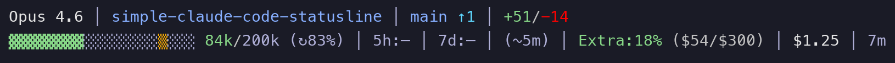
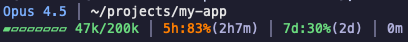
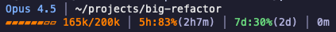
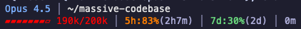
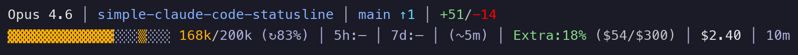

# Simple Claude Code Statusline

[](LICENSE)

A minimal, hackable two-line statusline for Claude Code.



## Features

**Line 1:** Model | Directory | Git branch + status
**Line 2:** Context usage bar | 5h rate limit | 7d rate limit | Session duration

- Tokyo Night color scheme
- Context usage with color-coded progress bar
- Rate limit tracking with time until reset
- Git branch with added/modified/deleted counts
- No build step - just bash

### Context Usage Colors

| Usage | Color | Example |
|-------|-------|---------|
| 0-50% | Green |  |
| 51-75% | Yellow |  |
| 76-90% | Orange |  |
| 91%+ | Red |  |

### Git Status

Shows branch name with file counts:



## Requirements

- `jq` - JSON parsing
- `curl` - Rate limit API calls
- `git` - Repository status (optional)

Install jq on macOS:
```sh
brew install jq
```

## Installation

### Option 1: Plugin (recommended)

Add the marketplace:
```sh
/plugin marketplace add Postmodum37/simple-claude-code-statusline
```

Install the plugin:
```sh
/plugin install simple-statusline
```

Restart Claude Code, then configure:
```sh
/simple-statusline:setup
```

The statusline appears immediately after setup (no second restart needed).

### Option 2: Manual

Copy the script:
```sh
curl -o ~/.claude/statusline.sh https://raw.githubusercontent.com/Postmodum37/simple-claude-code-statusline/main/bin/statusline.sh
chmod +x ~/.claude/statusline.sh
```

Add to `~/.claude/settings.json`:
```json
{
  "statusLine": {
    "type": "command",
    "command": "~/.claude/statusline.sh"
  }
}
```

Restart Claude Code.

## Customization

Edit `~/.claude/statusline.sh` directly. The script is self-contained and well-commented.

### Colors

Tokyo Night palette defined at the top:
```bash
C_ACCENT="\033[38;5;111m"     # Blue - model/branch
C_MUTED="\033[38;5;146m"      # Gray - separators
C_OK="\033[38;5;114m"         # Green - 0-50%
C_WARN="\033[38;5;214m"       # Yellow - 51-75%
C_HIGH="\033[38;5;208m"       # Orange - 76-90%
C_CRIT="\033[38;5;196m"       # Red - 91%+
```

### Layout

Modify the two-row output at the bottom of the script:
```bash
row1="$seg_model"
[[ -n "$dir_display" ]] && row1+="${sep}${seg_dir}"
[[ -n "$git_branch" ]] && row1+="${sep}${seg_git}"

row2="$seg_context"
[[ -n "$usage_5h" ]] && row2+="${sep}${seg_usage_5h}"
[[ -n "$usage_7d" ]] && row2+="${sep}${seg_usage_7d}"
row2+="${sep}${seg_duration}"
```

## Testing

Test the script manually:
```sh
echo '{"model":{"id":"claude-opus-4-5-20251101"},"cwd":"/tmp","context_window":{"used_percentage":42,"context_window_size":200000}}' | ~/.claude/statusline.sh
```

## Uninstalling

Clean up the statusline config first:
```sh
/simple-statusline:cleanup
```

Then uninstall the plugin:
```sh
/plugin uninstall simple-statusline
```

## License

MIT
