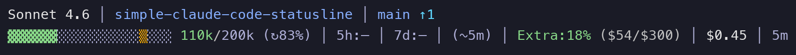

# Simple Claude Code Statusline

[](LICENSE)

A minimal, hackable two-line statusline for Claude Code.


## Features

**Line 1:** Model [agent] | Directory | Git branch + status | Session lines changed
**Line 2:** Context bar | 5h rate limit | 7d rate limit | Cost | Duration

- Tokyo Night color scheme
- Context usage with color-coded progress bar
- Rate limit tracking with time until reset
- Git branch with added/modified/deleted counts and ahead/behind tracking
- Git worktree support with `[wt:name]` indicator
- Agent name display when using `--agent` flag
- Session lines changed (cumulative +added/-removed)
- Session cost tracking ($X.XX)
- Auto-compact indicator (↻) when enabled
- Cross-platform (macOS and Linux)
- No build step - just bash

### Context Usage Colors

| Usage | Color | Meaning |
|-------|-------|---------|
| 0-50% | Green | Plenty of context remaining |
| 51-75% | Yellow | Getting full |
| 76-90% | Orange | Consider summarizing |
| 91%+ | Red | Near limit |

### Git Features


- **Branch name** with file status counts (✚added/●modified/✖deleted)
- **Ahead/behind** tracking: `↑2` commits ahead, `↓1` behind upstream
- **Worktree indicator**: `[wt:feature-name]` when in a linked worktree
- **Session lines changed**: `+44/-14` cumulative lines added/removed this session

### Model Display



Shows abbreviated model names: Opus 4.5, Sonnet 4, Haiku, etc.

## Requirements

- `jq` - JSON parsing
- `curl` - Rate limit API calls
- `git` - Repository status (optional)

On macOS, the script also uses the `security` command to retrieve OAuth tokens from keychain.

Install dependencies on macOS:
```sh
brew install jq
```

## Installation

### Option 1: Plugin (recommended)

Add the marketplace:
```sh
/plugin marketplace add Postmodum37/simple-claude-code-statusline
```

Install the plugin:
```sh
/plugin install simple-statusline
```

Restart Claude Code, then configure:
```sh
/simple-statusline:setup
```

The statusline appears immediately after setup (no second restart needed).

### Option 2: Manual

Copy the script:
```sh
curl -o ~/.claude/statusline.sh https://raw.githubusercontent.com/Postmodum37/simple-claude-code-statusline/main/bin/statusline.sh
chmod +x ~/.claude/statusline.sh
```

Add to `~/.claude/settings.json`:
```json
{
  "statusLine": {
    "type": "command",
    "command": "~/.claude/statusline.sh"
  }
}
```

Restart Claude Code.

## Customization

Edit `~/.claude/statusline.sh` directly. The script is self-contained and well-commented.

### Colors

Tokyo Night palette defined at the top:
```bash
C_ACCENT="\033[38;5;111m"     # Blue - model/branch
C_MUTED="\033[38;5;146m"      # Gray - separators
C_OK="\033[38;5;114m"         # Green - 0-50%
C_WARN="\033[38;5;214m"       # Yellow - 51-75%
C_HIGH="\033[38;5;208m"       # Orange - 76-90%
C_CRIT="\033[38;5;196m"       # Red - 91%+
```

### Layout

Modify the two-row output at the bottom of the script:
```bash
row1="$seg_model"
[[ -n "$dir_display" ]] && row1+="${sep}${seg_dir}"
[[ -n "$git_branch" ]] && row1+="${sep}${seg_git}"

row2="$seg_context"
[[ -n "$usage_5h" ]] && row2+="${sep}${seg_usage_5h}"
[[ -n "$usage_7d" ]] && row2+="${sep}${seg_usage_7d}"
row2+="${sep}${seg_duration}"
```

## JSON Input Reference

Claude Code pipes JSON to statusline scripts via stdin. The official docs don't cover all available fields - here's what's actually available (as of Claude Code 2.1.12):

### Documented Fields

```json
{
  "hook_event_name": "Status",
  "session_id": "abc123...",
  "cwd": "/current/working/directory",
  "model": {
    "id": "claude-opus-4-5-20251101",
    "display_name": "Opus 4.5"
  },
  "workspace": {
    "current_dir": "/current/working/directory",
    "project_dir": "/original/project/directory"
  },
  "version": "2.1.12",
  "cost": {
    "total_cost_usd": 0.05,
    "total_duration_ms": 120000,
    "total_lines_added": 156,
    "total_lines_removed": 23
  }
}
```

### Undocumented Fields (added in v2.1.6)

These fields are available but not in the official statusline documentation:

```json
{
  "context_window": {
    "context_window_size": 200000,
    "used_percentage": 45,
    "remaining_percentage": 55,
    "current_usage": {
      "input_tokens": 50000,
      "output_tokens": 20000,
      "cache_creation_input_tokens": 10000,
      "cache_read_input_tokens": 10000
    }
  }
}
```

| Field | Description |
|-------|-------------|
| `context_window.context_window_size` | Total context window size in tokens |
| `context_window.used_percentage` | Percentage of context used (0-100) |
| `context_window.remaining_percentage` | Percentage remaining (0-100) |
| `context_window.current_usage.*` | Breakdown of token usage by type |

### Rate Limits (via OAuth API)

This plugin also fetches rate limit data from the Anthropic API (requires OAuth authentication):

- **macOS:** Uses keychain (`security find-generic-password`)
- **Linux:** Reads from `~/.claude/.credentials.json`

The API returns 5-hour and 7-day utilization percentages with reset times.

## Testing

Test the script manually:
```sh
echo '{"model":{"id":"claude-opus-4-5-20251101"},"cwd":"/tmp","context_window":{"used_percentage":42,"context_window_size":200000},"cost":{"total_duration_ms":3600000,"total_lines_added":50,"total_lines_removed":10}}' | ~/.claude/statusline.sh
```

## Uninstalling

Clean up the statusline config first:
```sh
/simple-statusline:cleanup
```

Then uninstall the plugin:
```sh
/plugin uninstall simple-statusline
```

## License

MIT
