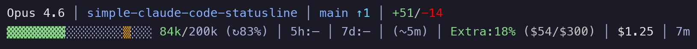
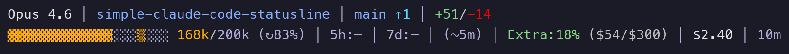
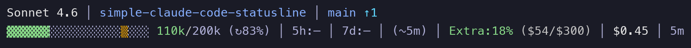

# Simple Claude Code Statusline

[](LICENSE)

A minimal, hackable two-line statusline for Claude Code.



## Features

**Line 1:** Model [agent] | Directory | Git branch + status | Session lines changed
**Line 2:** Context bar | 5h rate limit | 7d rate limit | Cost | Duration

- Tokyo Night color scheme
- Context usage with color-coded progress bar
- Rate limit tracking with time until reset
- Git branch with added/modified/deleted counts and ahead/behind tracking
- Git worktree support with `[wt:name]` indicator
- Agent name display when using `--agent` flag
- Session lines changed (cumulative +added/-removed)
- Session cost tracking ($X.XX)
- Auto-compact indicator (↻) when enabled
- `>200k` token threshold indicator (fast mode pricing doubles past 200k)
- Cross-platform (macOS and Linux)
- Cross-compiled Go binaries — zero runtime dependencies

### Context Usage Colors

| Usage | Color | Meaning |
|-------|-------|---------|
| 0-50% | Green | Plenty of context remaining |
| 51-75% | Yellow | Getting full |
| 76-90% | Orange | Consider summarizing |
| 91%+ | Red | Near limit |

### Git Features



- **Branch name** with file status counts (✚added/●modified/✖deleted)
- **Ahead/behind** tracking: `↑2` commits ahead, `↓1` behind upstream
- **Worktree indicator**: `[wt:feature-name]` when in a linked worktree
- **Session lines changed**: `+44/-14` cumulative lines added/removed this session

### Model Display



Shows abbreviated model names: Opus 4.6, Sonnet 4.5, Haiku, etc.

## Requirements

- `git` — Repository status (optional)

The plugin ships as pre-compiled Go binaries with no runtime dependencies.

## Installation

### Option 1: Plugin (recommended)

Add the marketplace:
```sh
/plugin marketplace add Postmodum37/simple-claude-code-statusline
```

Install the plugin:
```sh
/plugin install simple-statusline
```

Restart Claude Code, then configure:
```sh
/simple-statusline:setup
```

The statusline appears immediately after setup (no second restart needed).

### Option 2: Manual

Clone the repo and build:
```sh
git clone https://github.com/Postmodum37/simple-claude-code-statusline.git
cd simple-claude-code-statusline
make build
```

Copy the shim and your platform's binary:
```sh
cp bin/statusline.sh ~/.claude/statusline.sh
chmod +x ~/.claude/statusline.sh
mkdir -p ~/.claude/bin
cp bin/$(uname -s | tr '[:upper:]' '[:lower:]')-$(uname -m | sed 's/x86_64/amd64/;s/aarch64/arm64/')/statusline ~/.claude/bin/statusline
```

Add to `~/.claude/settings.json`:
```json
{
  "statusLine": {
    "type": "command",
    "command": "~/.claude/bin/statusline"
  }
}
```

Restart Claude Code.

## Customization

Fork the repo and edit the Go source. Colors are defined as constants in `src/render.go`, and the two-row layout is built in `buildRow1`/`buildRow2`. Run `make build` to compile after changes.

## JSON Input Reference

Claude Code pipes JSON to statusline commands via stdin. Here's the complete schema (as of Claude Code v2.1.85):

```json
{
  "session_id": "abc123...",
  "cwd": "/current/working/directory",
  "version": "2.1.85",
  "transcript_path": "/path/to/transcript.jsonl",
  "model": {
    "id": "claude-opus-4-6",
    "display_name": "Opus"
  },
  "workspace": {
    "current_dir": "/current/working/directory",
    "project_dir": "/original/project/directory"
  },
  "cost": {
    "total_cost_usd": 0.05,
    "total_duration_ms": 120000,
    "total_api_duration_ms": 95000,
    "total_lines_added": 156,
    "total_lines_removed": 23
  },
  "context_window": {
    "context_window_size": 200000,
    "used_percentage": 45,
    "remaining_percentage": 55,
    "total_input_tokens": 15234,
    "total_output_tokens": 4521,
    "current_usage": {
      "input_tokens": 50000,
      "output_tokens": 20000,
      "cache_creation_input_tokens": 10000,
      "cache_read_input_tokens": 10000
    }
  },
  "exceeds_200k_tokens": false,
  "rate_limits": {
    "five_hour": {
      "used_percentage": 23.5,
      "resets_at": 1738425600
    },
    "seven_day": {
      "used_percentage": 41.2,
      "resets_at": 1738857600
    }
  },
  "vim": {
    "mode": "NORMAL"
  },
  "output_style": {
    "name": "default"
  },
  "agent": {
    "name": "my-agent"
  },
  "worktree": {
    "name": "my-feature",
    "path": "/path/to/.claude/worktrees/my-feature",
    "branch": "worktree-my-feature",
    "original_cwd": "/path/to/project",
    "original_branch": "main"
  }
}
```

| Field | Used | Description |
|-------|------|-------------|
| `model.id` / `model.display_name` | Yes | Current model identifier and display name |
| `cwd` / `workspace.current_dir` | Yes | Current working directory |
| `workspace.project_dir` | Yes | Directory where Claude Code was launched |
| `context_window.used_percentage` | Yes | Percentage of context used (0-100) |
| `context_window.remaining_percentage` | — | Percentage remaining (inverse of used) |
| `context_window.context_window_size` | Yes | Maximum context window size in tokens |
| `context_window.current_usage.*` | Yes | Per-API-call token breakdown by type |
| `context_window.total_input_tokens` / `total_output_tokens` | — | Cumulative session token counts |
| `exceeds_200k_tokens` | Yes | Whether token count exceeds 200k (fast mode pricing threshold) |
| `cost.total_cost_usd` | Yes | Session cost in USD |
| `cost.total_duration_ms` | Yes | Session wall-clock time |
| `cost.total_api_duration_ms` | — | Time spent waiting for API responses |
| `cost.total_lines_added` / `total_lines_removed` | Yes | Session-cumulative lines changed |
| `rate_limits.five_hour.*` / `seven_day.*` | Yes | Rate limit usage (v2.1.80+, Claude.ai Pro/Max only) |
| `agent.name` | Yes | Agent name when using `--agent` flag |
| `worktree.name` | Yes | Worktree name during `--worktree` sessions |
| `worktree.branch` / `.path` / `.original_cwd` / `.original_branch` | — | Additional worktree details |
| `session_id` | — | Unique session identifier |
| `version` | — | Claude Code version string |
| `transcript_path` | — | Path to conversation transcript file |
| `vim.mode` | — | Vim mode (NORMAL/INSERT) when vim mode is enabled |
| `output_style.name` | — | Current output style name |

**Fields that may be absent:** `vim`, `agent`, `worktree`, `rate_limits` (Pro/Max only, after first API response).

**Fields that may be null:** `context_window.used_percentage`, `context_window.current_usage` (before first API call).

### Rate Limits

Rate limits are provided natively by Claude Code (v2.1.80+) via the `rate_limits` field. This plugin displays 5-hour and 7-day utilization percentages with time until reset. The field is only present for Claude.ai subscribers (Pro/Max) after the first API response in the session.

## Testing

Run the Go test suite:
```sh
make test
```

Test the binary manually by piping sample JSON:
```sh
echo '{"model":{"id":"claude-opus-4-6"},"cwd":"/tmp","context_window":{"used_percentage":42,"context_window_size":200000},"cost":{"total_duration_ms":3600000,"total_lines_added":50,"total_lines_removed":10}}' | ./bin/statusline.sh
```

## Uninstalling

Clean up the statusline config first:
```sh
/simple-statusline:cleanup
```

Then uninstall the plugin:
```sh
/plugin uninstall simple-statusline
```

## License

MIT
