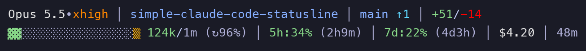
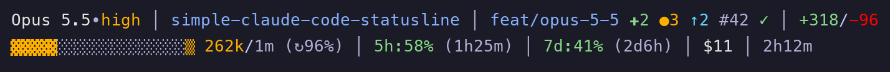
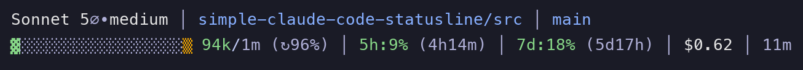

# Simple Claude Code Statusline

[](LICENSE)

A minimal, hackable two-line statusline for Claude Code.



## Features

**Line 1:** Model [⚡fast] [*thinking] [•effort] [agent] | Directory | Git branch + status + PR badge | Session lines changed
**Line 2:** Context bar | 5h rate limit | 7d rate limit | Cost | Duration

- Tokyo Night color scheme
- Context usage with color-coded progress bar
- Rate limit tracking with time until reset
- Git branch with added/modified/deleted counts and ahead/behind tracking
- Open PR badge with review state (`#1234 ⏳`, or `!1234` for GitLab merge requests) when Claude Code detects a PR for the current branch
- Git worktree support with `[wt:name]` indicator
- Reasoning effort level (`•high`), extended-thinking marker (`*`), and fast-mode marker (`⚡`)
- Agent name display when using `--agent` flag
- Session lines changed (cumulative +added/-removed)
- Session cost tracking ($X.XX)
- Auto-compact indicator (↻) with the exact threshold Claude Code will compact at, honoring `autoCompactEnabled`/`autoCompactWindow` in `settings.json` and the `CLAUDE_CODE_AUTO_COMPACT_WINDOW`/`CLAUDE_AUTOCOMPACT_PCT_OVERRIDE`/`DISABLE_AUTO_COMPACT` env vars
- `>200k` token threshold indicator (fast mode pricing doubles past 200k)
- Cross-platform (macOS and Linux)
- Cross-compiled Go binaries — zero runtime dependencies

### Context Usage Colors

The bar, token count, and percentage are colored by the **worse** of two signals: how full the window is, and how many tokens are in it. Model quality degrades with absolute context length regardless of window size (practitioners put the safe zone around 100–150k tokens; the Claude Code team describes context rot setting in around 300–400k), so on a 1M window the color turns before the bar looks full.

| % of window | Absolute tokens | Color | Meaning |
|-------------|-----------------|-------|---------|
| 0-50% | ≤150k | Green | Plenty of headroom |
| 51-75% | ≤300k | Yellow | Getting long — consider `/clear` when switching tasks |
| 76-90% | ≤400k | Orange | Quality likely degrading; `/compact` or `/clear` |
| 91%+ | >400k | Red | Expect degraded recall / near the limit |

On a 200k window the absolute bands never change the color (150k is 75%), so the result is exactly the percent bands. The `(↻83%)` auto-compact marker is independent of color: it shows where Claude Code will mechanically compact, computed the same way Claude Code does (window − 20k output reserve − 13k buffer, so 83% on 200k and 96% on 1M).

### Rate Limit Colors

The 5h and 7d percentages are colored by **pace**, not raw fill: 80% used with 20 minutes left is fine, 40% used with 4.5 hours left will run out. The plugin projects end-of-window usage from the fraction of the window that has elapsed (derived from `resets_at`):

| Projected end-of-window usage | Color |
|-------------------------------|-------|
| < 85% | Green |
| 85–99% | Yellow |
| 100–119% | Orange |
| ≥ 120% | Red |

Two guards: below 20% used the color is capped at yellow (early-window projections are noisy), and at 75%+ / 90%+ used the color is at least orange / red regardless of pace, because a nearly empty window blocks you either way. Without a reset time the raw-fill bands above are used.

### Git Features



- **Branch name** with file status counts (✚added/●modified/✖deleted)
- **Ahead/behind** tracking: `↑2` commits ahead, `↓1` behind upstream
- **PR badge**: `#1234 ⏳` for the open PR on the current branch — ✓ approved, ⏳ pending, ✗ changes requested, ◌ draft (Claude Code v2.1.145+). GitLab merge requests render as `!1234`, matching Claude Code's own footer.
- **Worktree indicator**: `[wt:feature-name]` when in a linked worktree
- **Session lines changed**: `+44/-14` cumulative lines added/removed this session

### Model Display



Shows abbreviated model names: Mythos 5.1, Fable 5.1, Opus 5, Sonnet 5, Haiku 4.5, etc. A yellow `⚡` follows the name while fast mode is on.

## Requirements

- `git` — Repository status (optional)

The plugin ships as pre-compiled Go binaries with no runtime dependencies.

## Installation

### Option 1: Plugin (recommended)

Add the marketplace:
```sh
/plugin marketplace add Postmodum37/simple-claude-code-statusline
```

Install the plugin:
```sh
/plugin install simple-statusline
```

Restart Claude Code, then configure:
```sh
/simple-statusline:setup
```

The statusline appears immediately after setup (no second restart needed).

### Option 2: Manual

Clone the repo and build:
```sh
git clone https://github.com/Postmodum37/simple-claude-code-statusline.git
cd simple-claude-code-statusline
make build
```

Copy the shim and your platform's binary:
```sh
cp bin/statusline.sh ~/.claude/statusline.sh
chmod +x ~/.claude/statusline.sh
mkdir -p ~/.claude/bin
cp bin/$(uname -s | tr '[:upper:]' '[:lower:]')-$(uname -m | sed 's/x86_64/amd64/;s/aarch64/arm64/')/statusline ~/.claude/bin/statusline
```

Add to `~/.claude/settings.json`:
```json
{
  "statusLine": {
    "type": "command",
    "command": "~/.claude/bin/statusline"
  }
}
```

Restart Claude Code.

## Customization

Fork the repo and edit the Go source. Colors are defined as constants in `src/render.go`, and the two-row layout is built in `buildRow1`/`buildRow2`. Run `make build` to compile after changes.

## JSON Input Reference

Claude Code pipes JSON to statusline commands via stdin. Here's the complete schema (as of Claude Code v2.1.211):

```json
{
  "session_id": "abc123...",
  "session_name": "my-session",
  "prompt_id": "550e8400-e29b-41d4-a716-446655440000",
  "cwd": "/current/working/directory",
  "version": "2.1.211",
  "transcript_path": "/path/to/transcript.jsonl",
  "model": {
    "id": "claude-fable-5[1m]",
    "display_name": "Fable 5"
  },
  "workspace": {
    "current_dir": "/current/working/directory",
    "project_dir": "/original/project/directory",
    "added_dirs": [],
    "git_worktree": "feature-xyz",
    "repo": {
      "host": "github.com",
      "owner": "anthropics",
      "name": "claude-code"
    }
  },
  "cost": {
    "total_cost_usd": 0.05,
    "total_duration_ms": 120000,
    "total_api_duration_ms": 95000,
    "total_lines_added": 156,
    "total_lines_removed": 23
  },
  "context_window": {
    "context_window_size": 200000,
    "used_percentage": 45,
    "remaining_percentage": 55,
    "total_input_tokens": 15234,
    "total_output_tokens": 4521,
    "current_usage": {
      "input_tokens": 50000,
      "output_tokens": 20000,
      "cache_creation_input_tokens": 10000,
      "cache_read_input_tokens": 10000
    }
  },
  "exceeds_200k_tokens": false,
  "rate_limits": {
    "five_hour": {
      "used_percentage": 23.5,
      "resets_at": 1738425600
    },
    "seven_day": {
      "used_percentage": 41.2,
      "resets_at": 1738857600
    }
  },
  "effort": {
    "level": "high"
  },
  "thinking": {
    "enabled": true
  },
  "vim": {
    "mode": "NORMAL"
  },
  "output_style": {
    "name": "default"
  },
  "agent": {
    "name": "my-agent"
  },
  "pr": {
    "number": 1234,
    "url": "https://github.com/anthropics/claude-code/pull/1234",
    "review_state": "pending"
  },
  "worktree": {
    "name": "my-feature",
    "path": "/path/to/.claude/worktrees/my-feature",
    "branch": "worktree-my-feature",
    "original_cwd": "/path/to/project",
    "original_branch": "main"
  }
}
```

| Field | Used | Description |
|-------|------|-------------|
| `model.id` / `model.display_name` | Yes | Current model identifier and display name |
| `cwd` / `workspace.current_dir` | Yes | Current working directory |
| `workspace.project_dir` | Yes | Directory where Claude Code was launched |
| `context_window.used_percentage` | Yes | Percentage of context used (0-100) |
| `context_window.remaining_percentage` | — | Percentage remaining (inverse of used) |
| `context_window.context_window_size` | Yes | Maximum context window size in tokens |
| `context_window.current_usage.*` | Yes | Token breakdown for the current context; displayed count is input + cache creation + cache read, the same sum Claude Code uses for `used_percentage` |
| `context_window.total_input_tokens` / `total_output_tokens` | — | Tokens currently in the context window, from the most recent API response (cumulative before Claude Code v2.1.132) |
| `exceeds_200k_tokens` | Yes | Whether token count exceeds 200k (fast mode pricing threshold) |
| `fast_mode` | Yes | Whether fast mode (`/fast`) is on — shown as `⚡` after the model name |
| `cost.total_cost_usd` | Yes | Session cost in USD |
| `cost.total_duration_ms` | Yes | Session wall-clock time |
| `cost.total_api_duration_ms` | — | Time spent waiting for API responses |
| `cost.total_lines_added` / `total_lines_removed` | Yes | Session-cumulative lines changed |
| `rate_limits.five_hour.*` / `seven_day.*` | Yes | Rate limit usage (v2.1.80+, Claude.ai Pro/Max only) |
| `effort.level` | Yes | Reasoning effort: `low`/`medium`/`high`/`xhigh`/`max` (v2.1.119+) |
| `thinking.enabled` | Yes | Whether extended thinking is on (v2.1.119+) |
| `agent.name` | Yes | Agent name when using `--agent` flag |
| `pr.number` / `pr.review_state` | Yes | Open PR for current branch + review state (v2.1.145+) |
| `pr.kind` | Yes | `mr` for GitLab merge requests (rendered as `!N`); absent for GitHub PRs |
| `pr.url` | — | Open PR URL |
| `rate_limits.spend_limit.*` | — | Overage spend-limit window (gateway accounts only) |
| `prompt_cache.*` | — | Prompt-cache telemetry: `warm`, `ttl`, `expires_at`, `hit_ratio`, … |
| `remote.session_id` | — | Present in Remote Control sessions |
| `workspace.repo.{host,owner,name}` | — | Repo identity from `origin` remote (v2.1.145+) |
| `workspace.added_dirs` | — | Directories added via `/add-dir` |
| `workspace.git_worktree` | — | Linked git worktree name (we use `worktree` + git detection instead) |
| `worktree.name` | Yes | Worktree name during `--worktree` sessions |
| `worktree.branch` / `.path` / `.original_cwd` / `.original_branch` | — | Additional worktree details |
| `session_id` | — | Unique session identifier |
| `session_name` | — | Custom session name from `--name`/`/rename` |
| `prompt_id` | — | UUID of the user prompt being processed (v2.1.196+) |
| `version` | — | Claude Code version string |
| `transcript_path` | — | Path to conversation transcript file |
| `vim.mode` | — | Vim mode (NORMAL/INSERT/VISUAL/VISUAL LINE) when vim mode is enabled |
| `output_style.name` | — | Current output style name |

**Fields that may be absent:** `vim`, `agent`, `worktree`, `effort`, `pr` (only while an open PR is detected; `review_state` and `kind` may be independently absent), `prompt_cache` (absent until the first API request), `remote`, `session_name`, `prompt_id` (absent until the first user input), `workspace.repo`, `rate_limits` (Pro/Max only, after first API response).

**Fields that may be null:** `context_window.used_percentage`, `context_window.current_usage` (before first API call).

### Rate Limits

Rate limits are provided natively by Claude Code (v2.1.80+) via the `rate_limits` field. This plugin displays 5-hour and 7-day utilization percentages with time until reset. The field is only present for Claude.ai subscribers (Pro/Max) after the first API response in the session.

## Testing

Run the Go test suite:
```sh
make test
```

Test the binary manually by piping sample JSON:
```sh
echo '{"model":{"id":"claude-opus-4-6"},"cwd":"/tmp","context_window":{"used_percentage":42,"context_window_size":200000},"cost":{"total_duration_ms":3600000,"total_lines_added":50,"total_lines_removed":10}}' | ./bin/statusline.sh
```

## Uninstalling

Clean up the statusline config first:
```sh
/simple-statusline:cleanup
```

Then uninstall the plugin:
```sh
/plugin uninstall simple-statusline
```

## License

MIT
